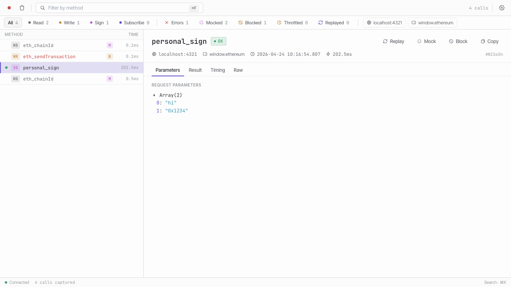
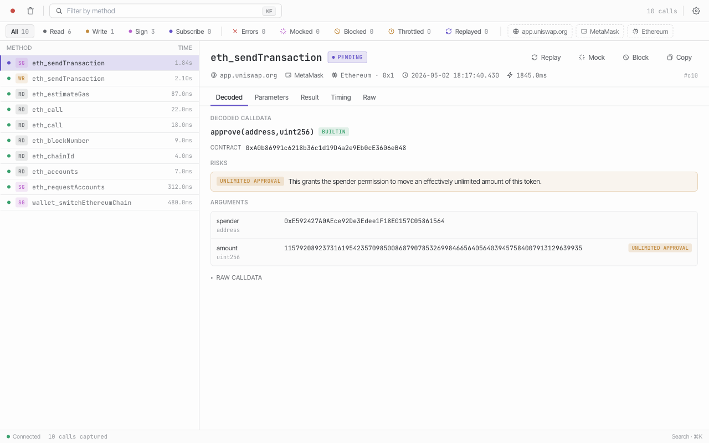
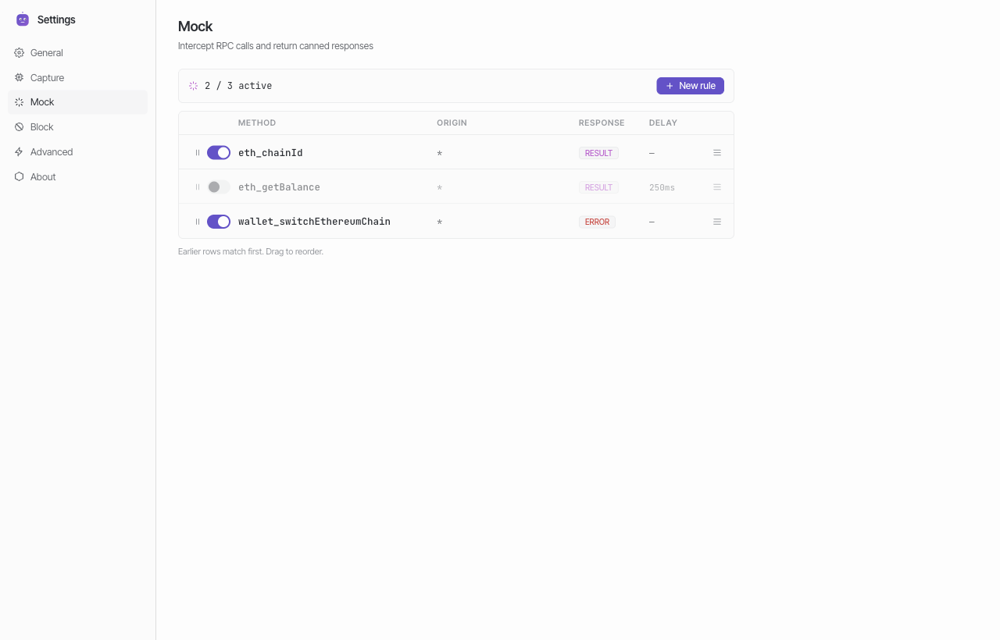
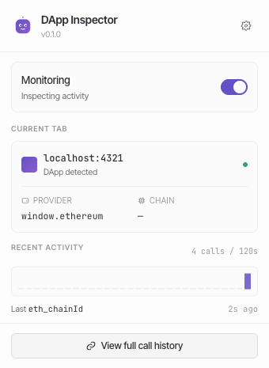
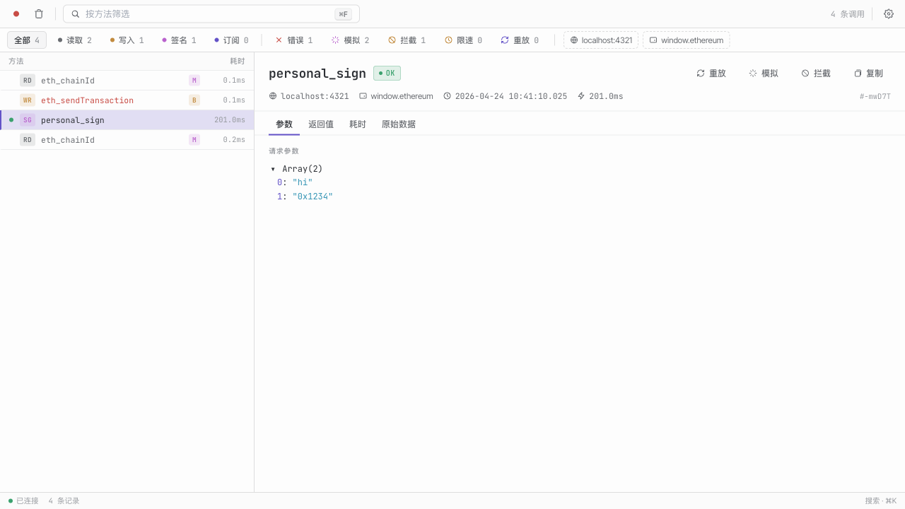
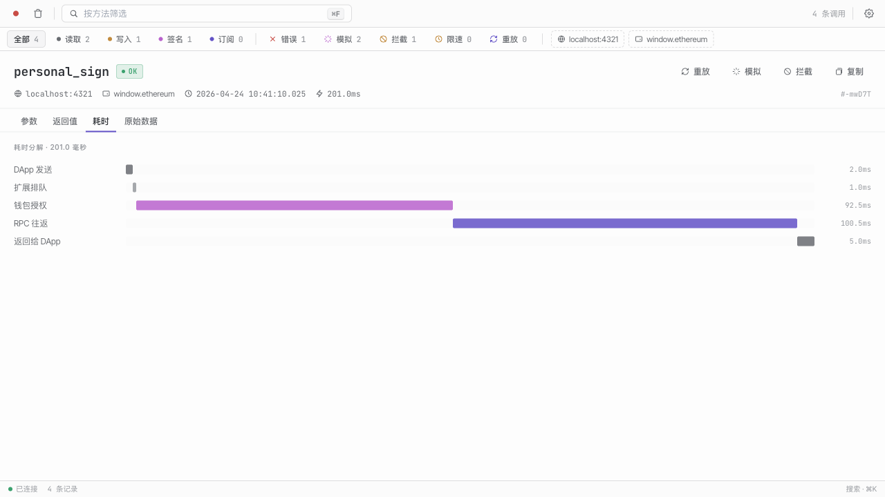
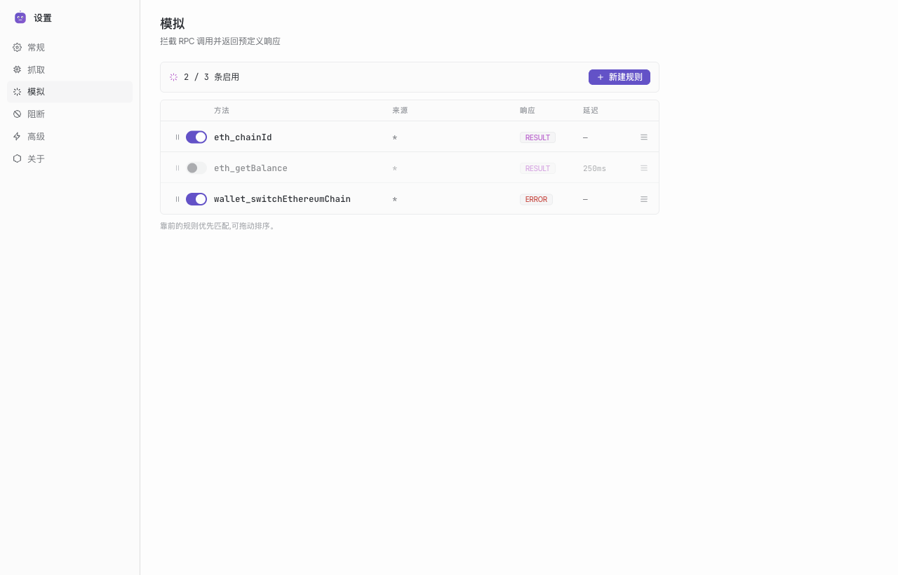
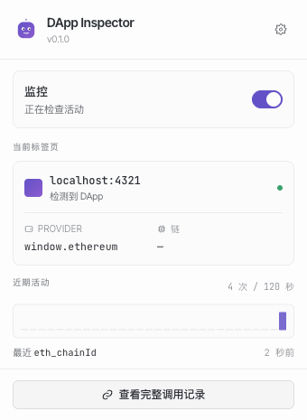

<div align="center">
  
  <h1>DApp Inspector</h1>
  <p><strong>A Chrome DevTools panel for inspecting and debugging Web3 RPC traffic between DApps and EVM wallets.</strong></p>
  <p>
    <a href="https://github.com/beilunyang/dapp-inspector-extension/releases/latest"></a>
    <a href="https://github.com/beilunyang/dapp-inspector-extension/actions/workflows/build.yml"></a>
    
    
  </p>
  <p><a href="#dapp-inspector">English</a> · <a href="#中文">中文</a></p>
</div>

---

## Screenshots

<table>
  <tr>
    <td align="center">
      
      <sub>DevTools panel — captured calls, filters, detail pane</sub>
    </td>
    <td align="center">
      
      <sub>Call detail — params, result, timing, Replay / Mock / Block</sub>
    </td>
  </tr>
  <tr>
    <td align="center">
      
      <sub>Options — Mock / Block &amp; Throttle rules</sub>
    </td>
    <td align="center">
      
      <sub>Popup — quick status, toggle monitoring</sub>
    </td>
  </tr>
</table>

---

## Features

- **Captures every JSON-RPC call** between a DApp and its injected Web3 provider (e.g. MetaMask, Rabby, OKX Wallet), classified as `read` / `write` / `sign` / `subscribe`.
- **Rich detail view** — request params, return value, timing breakdown (DApp dispatch → queue → throttle → wallet approval → RPC roundtrip → return), and the raw JSON-RPC envelope.
- **Filter & search** by method, origin, kind, errors, mocked / blocked / throttled / replayed.
- **Rule engine**:
  - **Block** — reject matching RPC requests with a custom error code/message.
  - **Throttle** — delay matching RPC requests to exercise slow-network and timeout paths.
  - **Mock** — short-circuit matching calls with a canned result or error, without touching the chain.
  - **Replay** — re-fire any captured call with optional JSON parameter edits; wallet re-prompts naturally.
- **Copy & export** — JSON-RPC envelope or Markdown row, ready for GitHub issues / Notion.
- **i18n** — English and 简体中文.
- **Privacy** — everything runs locally in your browser. No telemetry, no external servers.

> Currently EVM-only. Other ecosystems are on the roadmap.

## Install

### From a release (recommended)

1. Download `dapp-inspector-<version>.zip` from the [latest Release](https://github.com/beilunyang/dapp-inspector-extension/releases/latest).
2. Unzip it.
3. Open `chrome://extensions` in Chrome / Edge / Brave.
4. Toggle **Developer mode** on.
5. Click **Load unpacked** and pick the unzipped folder.

### From source

```bash
pnpm install
pnpm build
# then load ./dist as an unpacked extension
```

## Usage

1. Open any DApp in a tab that has a Web3 wallet extension installed.
2. Open Chrome DevTools (`F12` or `⌥⌘I`) → select the **DApp Inspector** tab.
3. Interact with the DApp — captured calls appear in real time.
4. Click a row to inspect params / result / timing, or click **Replay**, **Mock**, **Block** to act on it.
5. Manage persistent rules from the extension's **Options** page (right-click the toolbar icon → Options).

## Develop

Requirements: Node ≥ 20, pnpm 10.

```bash
pnpm install
pnpm dev        # vite dev mode (use `pnpm build` + load-unpacked for extension work)
pnpm typecheck  # tsc --noEmit
pnpm lint       # eslint
pnpm test       # vitest (unit)
pnpm test:e2e   # playwright (loads ./dist into a real Chromium)
pnpm build      # production build to ./dist
```

Releasing: bump `version` in `package.json`, prepend a new entry to `src/shared/changelog.ts`, merge to `main`, then push a `vX.Y.Z` tag — the `Build` workflow packages `dist/` and publishes a GitHub Release automatically.

## Tech stack

React 18 · Zustand · Tailwind · TypeScript · Vite · `@crxjs/vite-plugin` (Manifest V3) · Vitest · Playwright.

---

<a id="中文"></a>

# 中文

<div align="center">
  <p><strong>一个用于检查和调试 DApp 与 EVM 钱包之间 Web3 RPC 通信的 Chrome DevTools 面板。</strong></p>
</div>

## 截图

<table>
  <tr>
    <td align="center">
      
      <sub>DevTools 面板 — 捕获列表、过滤栏、详情窗格</sub>
    </td>
    <td align="center">
      
      <sub>调用详情 — 参数、返回值、耗时分解、重放 / 模拟 / 拦截</sub>
    </td>
  </tr>
  <tr>
    <td align="center">
      
      <sub>选项页 — 模拟 / 阻断 &amp; 限速规则管理</sub>
    </td>
    <td align="center">
      
      <sub>弹窗 — 快捷状态、开关监控</sub>
    </td>
  </tr>
</table>

## 功能

- **全量捕获** DApp 与注入式 Web3 provider（MetaMask、Rabby、OKX Wallet 等）之间的每一次 JSON-RPC 调用，并自动归类为 `read` / `write` / `sign` / `subscribe`。
- **详情视图**：请求参数、返回值、时延分解（DApp 派发 → 扩展排队 → Throttle 延迟 → 钱包审批 → RPC 往返 → 回到 DApp）、原始 JSON-RPC envelope。
- **过滤与搜索**：按方法、来源、类型、错误、mocked / blocked / throttled / replayed 快速筛选。
- **规则引擎**：
  - **Block** —— 按规则拒绝匹配的请求，可自定义错误码与错误消息。
  - **Throttle** —— 按规则延迟匹配的请求，用于验证慢网络 / 超时分支。
  - **Mock** —— 使用预设结果或错误短路匹配的调用，不触碰链上环境。
  - **Replay** —— 以可编辑的 JSON 参数重放任意捕获到的调用，钱包会按原流程再次提示。
- **复制与导出**：JSON-RPC envelope 或 Markdown 行，一键粘到 GitHub Issue / Notion。
- **多语言**：English / 简体中文。
- **隐私**：全部在本地浏览器中运行，无遥测、无外部服务器。

> 当前仅支持 EVM 链，其他生态已在规划中。

## 安装

### 通过 Release（推荐）

1. 在 [Releases](https://github.com/beilunyang/dapp-inspector-extension/releases/latest) 页面下载 `dapp-inspector-<version>.zip`。
2. 解压。
3. 打开 `chrome://extensions`。
4. 打开右上角的 **开发者模式**。
5. 点击 **加载已解压的扩展程序**，选择解压后的目录。

### 从源码

```bash
pnpm install
pnpm build
# 然后把 ./dist 作为已解压扩展加载
```

## 使用

1. 在任意打开了 Web3 钱包扩展的 DApp 标签页中打开 Chrome DevTools（`F12` 或 `⌥⌘I`）。
2. 切换到 **DApp Inspector** 面板。
3. 与 DApp 交互，捕获到的调用会实时出现。
4. 点击任意一行查看详情；或使用 **Replay / Mock / Block** 按钮对调用进行操作。
5. 持久规则可在扩展 **选项页**（右键工具栏图标 → 选项）管理。

## 开发

环境要求：Node ≥ 20，pnpm 10。

```bash
pnpm install
pnpm dev        # Vite dev（扩展调试仍建议 pnpm build + load unpacked）
pnpm typecheck
pnpm lint
pnpm test       # 单元测试
pnpm test:e2e   # Playwright 端到端（会加载 ./dist 到真实的 Chromium）
pnpm build      # 产出 ./dist
```

发版流程：更新 `package.json` 的 `version`，在 `src/shared/changelog.ts` 顶部补一条 entry，合并到 `main`，然后 push `vX.Y.Z` tag —— `Build` 工作流会自动打包 `dist/` 并发布 GitHub Release。

## 技术栈

React 18 · Zustand · Tailwind · TypeScript · Vite · `@crxjs/vite-plugin`（Manifest V3）· Vitest · Playwright。
